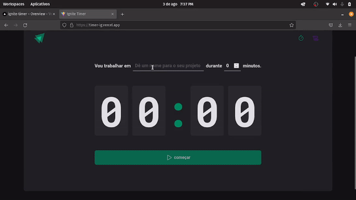

<h1 align="center">
    Todo
</h1>

<h1 align="center">
     
</h1>

## 🏷️ Sobre 
**Ignite.Timer**: Projeto criado durante a trilha de React.js do curso Ignite 2022 feito pela Rocketseat.
Se trata de um cronômetro onde você estabelece um determinado tempo para fazer uma tarefa. O app também mostra a tarefa em andamento, a tarefa que foi interrompida e a tarefa que foi finalizada com sucesso. 

---

## 🛠️ Tecnologias utilizadas
Foram utilizadas as seguintes tecnologias para desenvolver a aplicação **Ignite.Timer** :

- [HTML5](https://html.com/)
- [Styled-components](https://styled-components.com/)
- [React.js](https://pt-br.reactjs.org/)
- [Typescript](https://www.typescriptlang.org/)

## 🛠️ Destaque para:
- [x] styled-components
- [x] context API
- [x] useReducer

---

## 🗂️ Como baixar e iniciar o projeto 

```bash

    #clonar o projeto
    $ git clone https://github.com/ElisioWander/Ignite-timer.git

    #entrar no diretório
    $ cd Ignite-timer

    #instalar as dependências
    $ npm install

    #iniciar a aplicação
    $ npm run dev
```
### Servidor local
localhost:3000

---

## Autor
### 👤 Elisio Wander

- Linkedin: [@elisioWander](https://www.linkedin.com/in/elisio-wander-b88b69136/)
- Github: [@elisioWander](https://github.com/ElisioWander)
- Site: [elisiowander.vercel.app](https://elisiowander.vercel.app)
- Deploy: [Ignite-timer](https://timer-ig.vercel.app/)

---
## 📝 Licença
Copyright © 2020 [@ElisioWander](https://github.com/ElisioWander/Ignite-timer/blob/main/LICENSE)

Este projeto está sobe a [LICENÇA MIT](https://opensource.org/licenses/MIT)

---

### Desenvolvido 💜 by Elisio Wander
